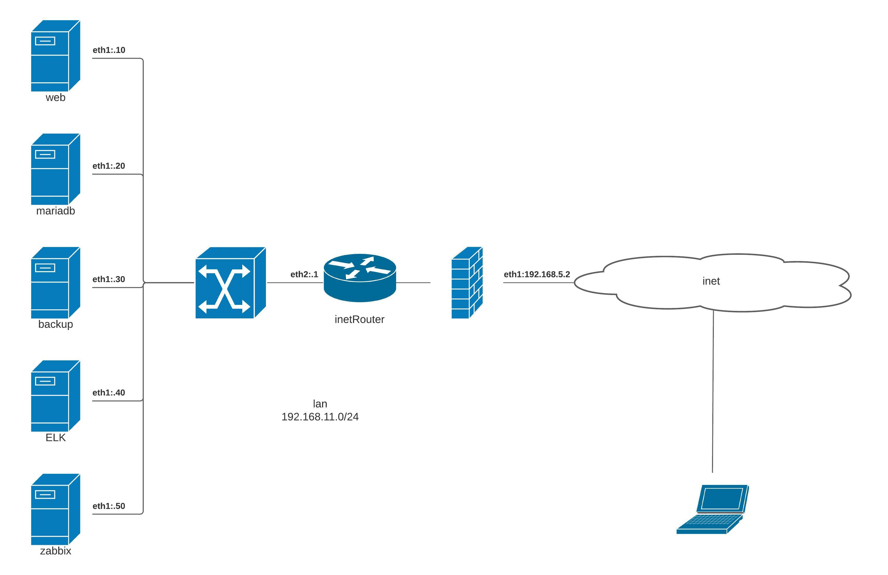

Развертывания IT-инфраструктура под веб-проект с мониторингом.

Цель проектной работы:

Создание рабочего проекта-веб проект с развертыванием нескольких виртуальных машин.

Требования:

- включен https
- основная инфраструктура в DMZ зоне
- файрвалл на входе
- сбор метрик и настроенный алертинг
- везде включен selinux
- организован централизованный сбор логов

Проектная документация



Для автоматического развертывания веб-сервера и сопутствующих инфраструктуры (мониторинг, логирование, алертинг, бэкапирование), необходимо, прописать адрес хоста `192.168.5.2 project-lab.local` в файле `hosts` и выполнить `vagrant up` ().

Описание стенда

|        IP         |    HOST    |              DESCRIPTION                 |
|-------------------|------------|------------------------------------------|
| ip: 192.168.11.1  | inetRouter | роутер (iptables)                        |
| ip: 192.168.11.10 | web        | сервер веб-приложения (Nginx + PHP)      |
| ip: 192.168.11.20 | mariadb    | сервер баз данных (MariaDB)              |
| ip: 192.168.11.30 | backup     | сервер для хранения бэкапов (Borgbackup) |
| ip: 192.168.11.40 | log        | сервер централизованного сбора логов     |
| ip: 192.168.11.50 | zabbix     | сервер мониторинга (Zabbix)              |


Устанавливаються и настраиваються следующие программы:
======================================================

inetRouter
----------

- rsyslog client;
- zabbix agent.

Настраиваеться межсетевой экран `iptables`:

- пробрасывается порт (80, 443) до nginx;
- остальной трафик дропаеться.

web
---

- nginx (перенаправляет запросы с 80 на 443 порт );
- php-fpm (настраиваеться unix-сокет);
- wordpress (устанавливаеться чистый WordPress);
- borgbackup (делается бэкап директории `wordpress` по таймеру (каждые 5 мин.) и сохраняется на хосте `backup` в директори `/backup/dir_site`)
- rsyslog client;
- zabbix agent.

В браузере переходим по адрессу (https://project-lab.local), после необходимо сконфигурировать вручную в веб проект (логин: Admin, пароль: zabbix).


mariadb
-------

- mariadb (делается бэкап db `wordpress` по таймеру (каждые 5 мин.) и сохраняет на хосте `backup` в директори `/backup/db_site`)
- rsyslog client;
- zabbix agent.

backup
------

- borgbackup
- rsyslog client;
- zabbix agent.

log
---

- rsyslog server;
- zabbix agent.


zabbix
------

- rsyslog client;
- zabbix server.

В браузере переходим по адрессу (https://192.168.5.3), после необходимо сконфигурировать вручную в веб интерфейсе (логин: Admin, пароль: zabbix).

Сконфигурируем `zabbix` и настроим zabbix сервер, авторегистрация агентов.


Переходим в меню Configuration (Настройки) -> Actions (Действия) -> Event source (создать действие). Источник выбираем «Auto registration (Авторегистрация)»


На открывшейся странице на вкладке «Action (Действия)» заполняем следующие поля


Здесь
Name (Имя) — любое название действия

New condition (Новое условие) — выбираем «Host metadata (Метаданные узлов сети)» — «does not contain (содержит)» и здесь вписываем строку по которой будем идентифицировать регистрируемые хосты.

Затем переходим на вкладку «Operaations (Операции)». И здесь в поле «Operations (операции)» кликаем по ссылке «New (Новый)». И добавляем правила которые необходимо применить при регистрации хоста.


После этого нажимаем большую кнопку «Добавить». На этом настройку сервера можно считать завершенной.


Восстановление mysql из бекапа:
===============================

1. Подключаемся к хосту `mariadb`
2. Останавливаем бекап db
```
[root@mariadb ~]# systemctl stop db-backup.timer
```
3. Воспользуемся скриптоп `recover_db_wordpres.sh` (восстановить базу mysql и запустит бекап)
```
[root@mariadb ~]# sh recover_db_wordpres.sh
```

Восстановление деректории сайта из бекапа:
==========================================

1. Подключаемся к хосту `web`
2. Останавливаем бекап директории веб
```
[root@web ~]# systemctl stop borg-backup.timer
```
3. Воспользуемся скриптоп `recovery.sh` (восстановить директорию веб и запустит бекап)
```
[root@web ~]# sh recovery.sh
```


